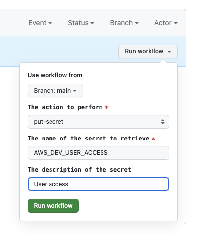

# secrets-management

The repository contains the Terraform code which creates the OIDC Provider, IAM roles, and policies to manage the secrets in AWS Secrets Manager.

This might be used by the GitHub Actions to create the secrets in AWS Secrets Manager and then use them in the deployment process.

## GitHub Actions Usage

To run the GitHub Actions Pipeline you should first create the **Repository Secret**. Then use the **Actions** button (blocked in this repository) and fill the form with the following content as in the example below:



## Terraform IAM

```hcl
module "secrets_management" {
  source = "terraform/modules/iam"

  create = true

  url      = "https://token.actions.githubusercontent.com"

  name     = "DataIOSecretsManagerPipelineWithOIDC"
  policies = {
    "GitHubOIDC" = "arn:aws:iam::aws:policy/SecretsManagerReadWrite"
  }
  subjects = [
    "dataio-pl/secrets-management:*"
  ]
}
```

## Terraform Helm

```hcl
module "external_secret" {
  source = "terraform/modules/helm"

  enabled          = true

  name             = "external-secret"
  description      = "Configure Secrets Management"
  namespace        = "utils"
  create_namespace = false
  repository       = "https://charts.external-secrets.io"
  chart            = "external-secrets"
  chart_version    = "0.9.13"
  chart_values     = [<<EOF
replicaCount: 1
image:
  repository: "ghcr.io/external-secrets/external-secrets"
  tag: "v0.9.13"
  pullPolicy: IfNotPresent
EOF
]
}
```